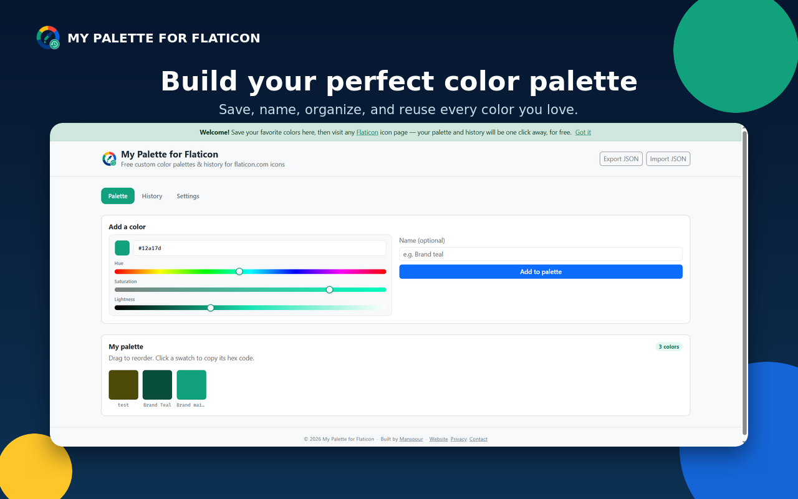
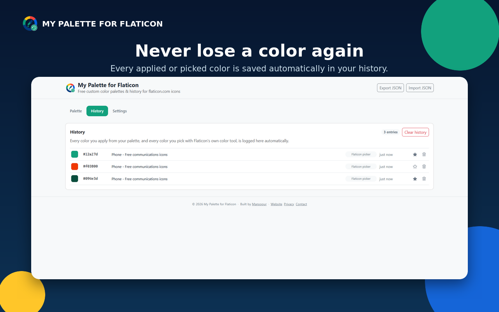
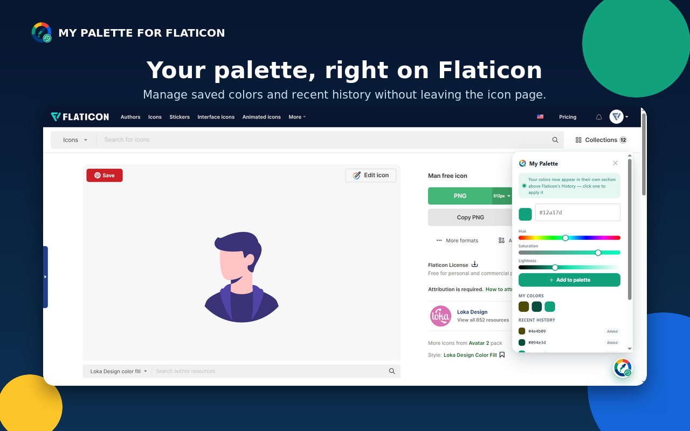
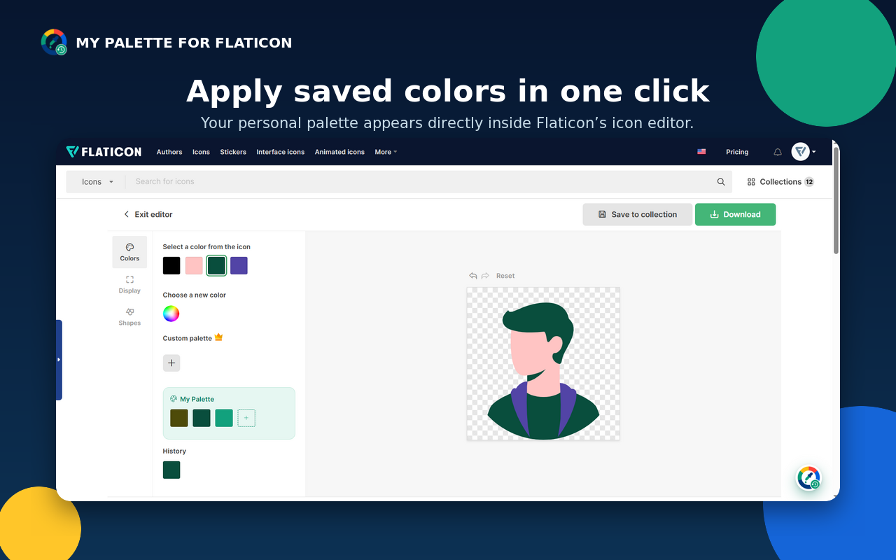
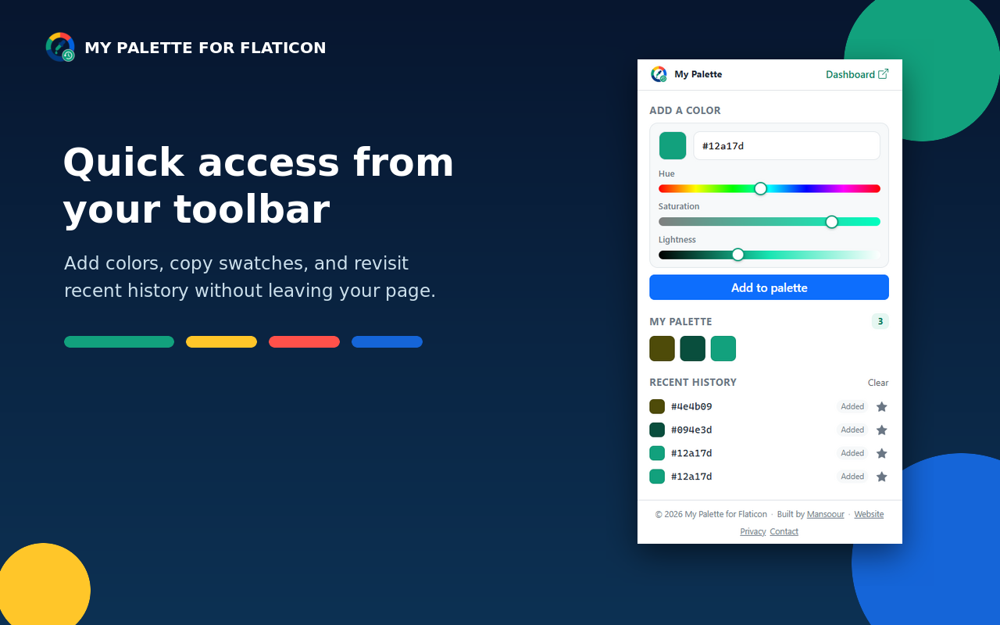

# My Palette for Flaticon 🎨

A free, open-source Chrome extension that gives [Flaticon](https://www.flaticon.com/) users
**unlimited custom color palettes** and **automatic color history** — the "Custom palette"
feature Flaticon otherwise locks behind a paid subscription.

**[Website](https://mansoour.com/mypalette/)** ·
**[Privacy policy](https://mansoour.com/mypalette/privacy-policy.html)** ·
**[Contact](https://mansoour.com/mypalette/contact.html)** ·
**[GitHub](https://github.com/mansoour/my-palette-for-flaticon)** ·
Built by [Mansoour](https://mansoour.com)

> Not affiliated with, endorsed by, or connected to Flaticon / Freepik Company in any way.
> This is an independent, unofficial browser extension.

## Why

Flaticon's built-in icon editor lets you recolor an icon from the colors already in it, or pick
one new color with a color wheel — but **saving a reusable custom palette is a paid feature**
(you'll see a 👑 next to "Custom palette" in the editor). This extension adds that missing piece
for free, entirely client-side, using your own browser storage.

Example icon page this was built against:
https://www.flaticon.com/free-icon/degree_4011018?related_id=4011018

## Screenshots

| | |
|---|---|
|  |  |
| Build your palette in the dashboard | Automatic color history |
|  |  |
| The floating panel on any Flaticon page | One-click apply inside the icon editor |
|  | |
| The toolbar popup | |

## Features

- **Unlimited saved colors** — add any hex color to your personal palette from the popup, the
  full dashboard, or directly on a Flaticon icon page.
- **One click on any icon page** — a small floating palette button appears on every flaticon.com page.
  Open it to see your saved palette and recent history without leaving the page.
- **Automatic history** — every color you apply from your palette, and every color you pick with
  Flaticon's *own* color tool, is logged automatically with a timestamp and a link back to the
  icon page it came from.
- **Full dashboard** — a dedicated page (opens from the toolbar icon or the floating panel) to
  manage your whole palette: add, rename, reorder (drag & drop), delete, and browse/search your
  full history.
- **Import / export** — back up or move your palette and history as a single JSON file.
- **Custom color picker everywhere** — a hue/saturation/lightness slider picker used in the
  popup, dashboard, floating panel, and the embedded editor section. No native
  `<input type="color">` anywhere, since that has caused real problems (see
  [CHANGELOG.md](CHANGELOG.md)): it closes an extension popup on open, and turned out unreliable
  when embedded in Flaticon's own editor page.
- **A settings page** (Dashboard → Settings) to turn the floating panel on Flaticon pages on or
  off, independent of the "My Palette" section embedded in Flaticon's own editor.
- **Private by design** — everything is stored with the standard `chrome.storage` API
  (`sync` for your palette and settings, `local` for history). Nothing ever leaves your browser;
  there is no backend server. See [PRIVACY_POLICY.md](PRIVACY_POLICY.md).
- **Free & open source**, MIT licensed, no ads, no account required, built with
  [Bootstrap 5](https://getbootstrap.com/) (self-hosted, no CDN) for the popup and dashboard.

## How it works

The extension has three layers, so it stays useful even as Flaticon's website evolves:

1. **Guaranteed layer — the floating panel.** A small palette button is injected on every
   `flaticon.com` page, mounted on `<html>` rather than `<body>` so it can't be knocked out of
   position by a `transform`/`filter` a real site's `<body>` happens to use (see
   [CHANGELOG.md](CHANGELOG.md) for exactly how that bit us once). It works completely
   independently of Flaticon's own markup: add colors with the built-in
   hue/saturation/lightness picker, browse your palette, copy any color to the clipboard, and see
   your recent history — all without leaving the page.

2. **Embedded layer — a "My Palette" section on the icon editor, right before "History".**
   Flaticon's icon editor renders the icon's own colors, and its "History" of applied colors, as
   plain lists of `<li class="color"><button data-actual="#hex" style="background:#hex"></button>
   </li>` elements (`#svg-icon-colors` and `#last-icon-colors`). This extension inserts its own
   section using the same swatch markup — for consistent native sizing — but keeps it entirely
   separate from Flaticon's own lists, labeled "My Palette", right above Flaticon's "History".

   Clicking one of your colors there doesn't rely on Flaticon's click handling (testing showed
   that's bound per-button at creation time, so a button inserted from outside never gets it);
   instead it drives Flaticon's own Pickr hex field (`#icon-edit-color-picker .pcr-result`, a
   [Pickr](https://github.com/Simonwep/pickr) instance) with the same events a real user typing
   into it would fire. Pickr only finishes wiring up its change handling once its popup has
   actually finished opening (an instant same-tick open→set→close turned out to be faster than
   that and silently did nothing), so the extension opens it, waits briefly, sets the value, waits
   again to verify the icon's color actually changed, and only then closes it back — a brief,
   real open of Flaticon's own picker, small enough to barely register but the trade-off needed
   for it to reliably work every time.

   Capturing colors watches `#last-icon-colors` separately: whenever Flaticon adds or updates an
   entry there — whether from clicking one of the icon's own colors or dialing one in with
   Flaticon's "Choose a new color" wheel — this extension mirrors that hex into its own history
   (tagged `Flaticon picker`), so it survives page reloads instead of vanishing with Flaticon's
   own in-memory, per-visit history.

3. **Management layer — the toolbar popup, the full dashboard, and Settings.** The toolbar popup
   gives quick add/copy/history access from anywhere, not just flaticon.com. The full dashboard
   (opens from the popup or `chrome://extensions` → Details → Extension options) manages your
   whole palette and history, handles JSON import/export, and has a Settings tab to turn the
   floating panel (layer 1) on or off — independently of the embedded section (layer 2), which
   stays on regardless.

Because layer 2 depends on Flaticon's live HTML (selectors captured from flaticon.com in
September 2026) and Flaticon can change that at any time without notice, it is written
defensively (feature-detected, wrapped in `try/catch`, re-scanned on DOM changes, with a
text-based fallback if Flaticon's ids ever change) and is allowed to silently do nothing if it
can't find what it's looking for — layers 1 and 3 always keep working regardless. If you notice
the panel's status never switches to "connected" on an icon page, please open an issue with a
screenshot of the editor's "History" section; selectors may just need an update (see
[CONTRIBUTING.md](CONTRIBUTING.md)).

## Install

### From source (recommended for now)

1. Download or clone this repository.
2. Open `chrome://extensions` in Chrome (or any Chromium browser — Edge, Brave, etc.).
3. Turn on **Developer mode** (top-right toggle).
4. Click **Load unpacked** and select the project folder (the one containing `manifest.json`).
5. Visit any Flaticon icon page and click the palette button in the bottom-right corner.

### From the Chrome Web Store

📤 **Submitted and awaiting review.** This extension has been submitted to the Chrome Web Store
and is currently in Google's review queue — it is not published yet. The store listing will be
linked here as soon as it goes live. See [store/STORE_LISTING.md](store/STORE_LISTING.md) for the
listing copy and submission checklist in the meantime.

## Project structure

```
manifest.json                Chrome Manifest V3 config
src/
  background/background.js   Service worker (badge count, opens dashboard)
  content/content.js          Injected on flaticon.com — floating panel + editor integration
  content/content.css
  popup/                      Toolbar popup (quick add / quick access), Bootstrap 5 styled
  dashboard/                  Full-page palette, history & settings manager (options page)
  shared/storage.js           chrome.storage wrapper shared by all surfaces
  shared/config.js            Branding/links (website, privacy, contact, GitHub, support email)
  shared/footer.js            Shared attribution footer, rendered on popup/dashboard/panel
  shared/colorpicker.js       Custom hue/saturation/lightness color picker (no native <input>)
  shared/icons.js             Inline Bootstrap Icons used across the UI
  shared/theme.css            Shared design tokens
  shared/vendor/bootstrap.min.css   Self-hosted Bootstrap 5 (MIT), used by popup + dashboard
icons/                        Extension icons (16 up to 1024 px) + the floating-button/logo art
store/                        Chrome Web Store listing copy, promo assets, screenshots
scripts/                      Packaging helpers for the Web Store zip
```

## Development

No build step — it's plain HTML/CSS/JS, loaded straight into Chrome. To iterate:

1. Make your changes.
2. Go to `chrome://extensions`, find the extension, click the refresh icon.
3. Reload any open Flaticon tab to pick up content-script changes.

To package a zip for the Chrome Web Store:

```sh
bash scripts/package.sh        # or scripts/package.ps1 on Windows PowerShell
```

This produces `dist/my-palette-for-flaticon-<version>.zip`, ready to upload in the
[Chrome Web Store Developer Dashboard](https://chrome.google.com/webstore/devconsole).

## Known limitations

- The embedded History integration targets Flaticon's current `#last-icon-colors` /
  `#svg-icon-colors` / `#icon-edit-color-picker` structure, with a text-based fallback if the ids
  change. It is not guaranteed to work if Flaticon redesigns their editor — the floating panel
  (add / copy / manage colors) always works regardless.
- `chrome.storage.sync` has a small quota, so the palette is capped at 500 colors; history (kept
  in `chrome.storage.local`) is capped at the most recent 200 entries. Use Export to keep a full
  backup.

## Contributing

Bug reports, selector fixes, and feature suggestions are welcome — see
[CONTRIBUTING.md](CONTRIBUTING.md).

## License

MIT — see [LICENSE](LICENSE).
